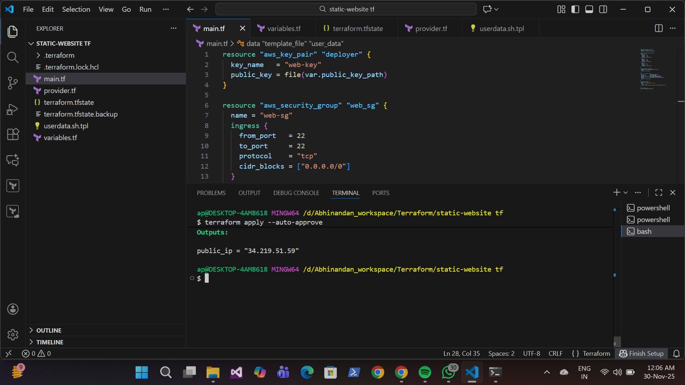
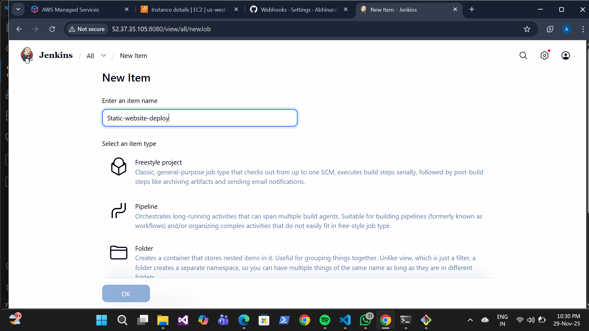
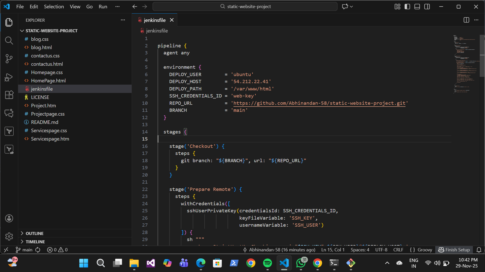
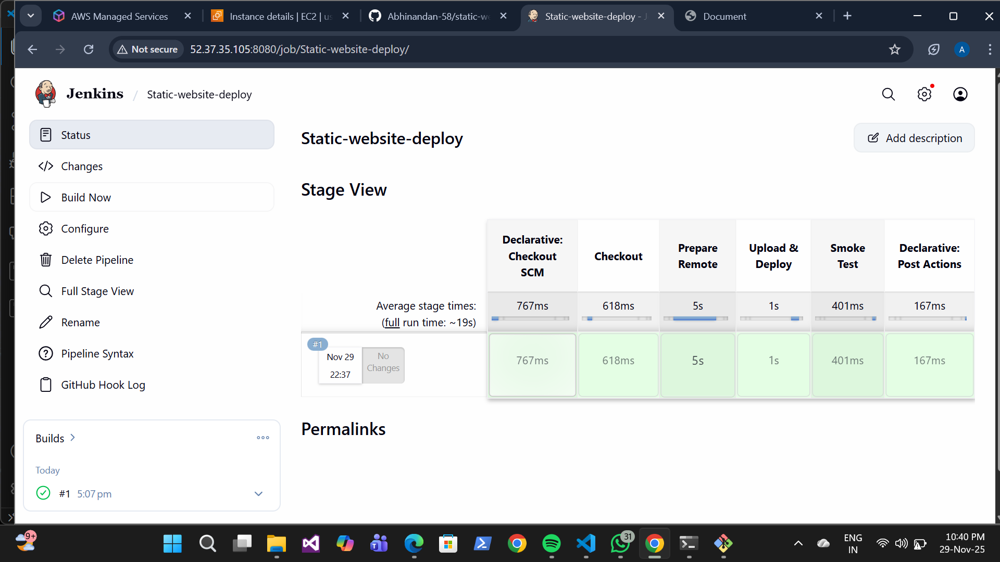
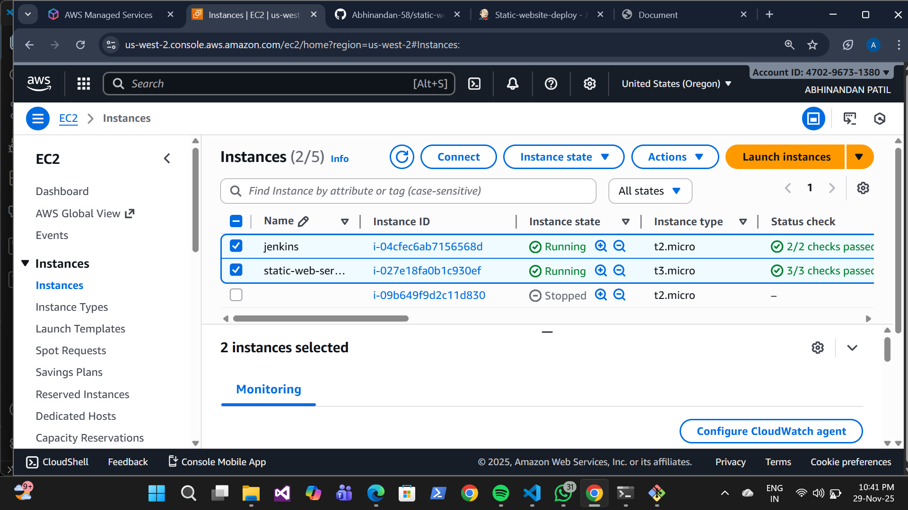
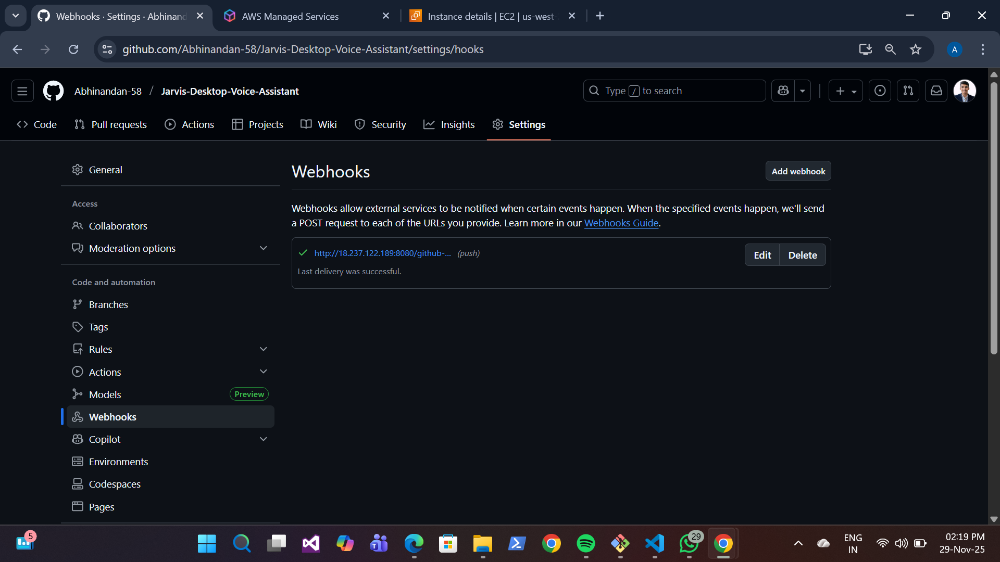
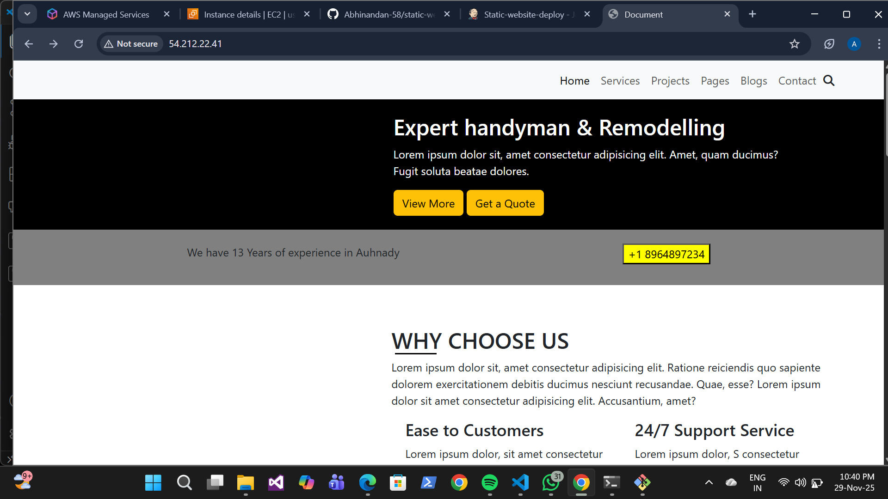

# Project Overview 

Deploy a static website on an Amazon EC2 instance (Nginx or Apache) using Terraform for infrastructure provisioning and Jenkins for continuous deployment. Changes pushed to the GitHub repo should automatically update the website on the EC2 instance via a Jenkins pipeline triggered by a GitHub webhook.

## High-Level Architecture

1. Developer forks static-website and makes UI changes.

2. Jenkins receives GitHub webhook on push -> triggers pipeline.

3. Jenkins job SSHs into EC2 and performs git pull in /var/www/html.

4. Web server serves updated content.

## Architecture Diagram

.png)

 ##  Technologies Used
- AWS EC2
- Terraform
- Jenkins
- GitHub Webhooks
- Nginx Web Server

## Steps to Deploy Project
### 1. Step-1: Fork the Project

- Fork the example static site repo  https://github.com/sruthi234/static-website-project to my GitHub account.

### Step-2: Create Terraform Files

Create a  directory and add these files:

1) provider.tf

           terraform {
         required_providers {
              aws = {
               source  = "hashicorp/aws"
               version = "~> 5.0"
                    }
                }
         required_version = ">= 1.0"
        }

         provider "aws" {
         region = var.aws_region
               }  

1) main.tf
  
        resource "aws_key_pair" "deployer" {
          key_name   = "web-deploy-key"
         public_key = file(var.public_key_path)
          }

         resource "aws_security_group "web_sg" {
           name = "web-sg"
              ingress {
                 from_port   = 22
                 to_port     = 22
                 protocol    = "tcp"
                 cidr_blocks = ["0.0.0.0/0"]
                  }
              ingress {
                 from_port   = 80
                 to_port     = 80
                 protocol    = "tcp"
                 cidr_blocks = ["0.0.0.0/0"]
                  }
              egress {
                  from_port   = 0
                 to_port     = 0
                 protocol    = "-1"
                 cidr_blocks = ["0.0.0.0/0"]
                  }
                }

        data "template_file" "user_data" {
          template = file("${path.module}/user_data.sh.tpl")
           vars = {
             repo_url = var.repo_url
                  }
            }       

        resource "aws_instance" "web" {
            ami = data.aws_ami.ubuntu.id
            instance_type = var.instance_type
             key_name = aws_key_pair.deployer.key_name
             vpc_security_group_ids = [aws_security_group.web_sg.id]
             user_data = data.template_file.user_data.rendered
             tags = {
               Name = "static-web-server"
                    }
               }  

        data "aws_ami" "ubuntu" {
          most_recent = true
          owners = ["099720109477"] # Ubuntu
          filter {
          name   = "name"
          values = ["ubuntu/images/hvm-ssd/ubuntu-focal-20.04-amd64-server-*"]
                }
          }

        output "public_ip" {
            value = aws_instance.web.public_ip
              }
            
3) variables.tf

        variable "aws_region" { 
            defaul"us-west-2" 
            } 
           variable "instance_type" { 
            default = "t3.micro"
             }
          variable "public_key_path" { 
            default = "~/.ssh/id_rsa.pub"
             }
          variable "repo_url" {
             default = "https://github.com/Abhinandan-58/Static-website-using-Terraform-Jenkins.git" 
          }

4) userdata.sh.tpl

         #!/bin/bash
         apt-get update -y
         apt-get install -y git nginx
         rm -rf /var/www/html/*
         git clone ${repo_url} /var/www/html
         chown -R www-data:www-data /var/www/html
         chmod -R 755 /var/www/html
         systemctl enable nginx
         systemctl restart nginx

### Step-3: Initialize and Apply Terraform

   From the terraform/ directory:

      terraform init
      terraform plan 
      terraform apply --auto-approve

## Jenkins Pipeline Setup
  - Create new item (Static-Website-deploy)

  

  - Write a Jenkinsfile-

  

## Jenkins Stage View (Pipeline Monitoring)

- This project uses two EC2 instances, each serving a different purpose:

1. Jenkins EC2 Instance (Manual / Pre-configured)

2. Website EC2 Instance (Provisioned by Terraform)

## GitHub Webhook Setup

*   In GitHub:

* Settings → Webhooks → Add Webhook

* Payload URL:  
http://<JENKINS_IP>:8080/github-webhook/

## How the Automation Works

* Developer pushes code to GitHub

* GitHub triggers Jenkins webhook

* Jenkins pipeline runs automatically

* EC2 server gets updated content

* Website reflects latest changes instantly

 ## Live Website
 
 * http://<public_ip>

 

## Cleanup

When you're done, destroy resources with Terraform to avoid charges:

    terraform destroy -auto-approve

Or terminate the EC2 instance and delete the security group and key pair manually.

## Conclusion

This project demonstrates how to:

- Use Terraform to provision a basic EC2 web server for a static site.

- Use a user-data script to bootstrap the instance (install web server and clone site).

- Use Jenkins and GitHub webhooks to automate deployments by pulling updates on the EC2 instance and restarting the web server.

